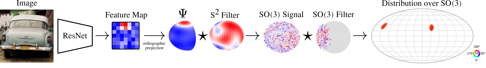

## Image to Sphere: Learning Equivariant Features for Efficient Pose Prediction
[Paper](https://openreview.net/forum?id=_2bDpAtr7PI) | [Project Page](https://dmklee.github.io/image2sphere/)

---------------------------------------------------------------------

This repository implements a hybrid equivariant model for SO(3) reasoning from 2D images for object pose estimation.
The underlying SO(3) symmetry of the pose estimation task is not accessible in an image, which can only be transformed
by in-plane rotations.  Our model, I2S, projects features from the image plane onto the sphere, which is SO(3) transformable.  Thus,
the model is able to leverage SO(3)-equivariant group convolutions which improve sample efficiency.  Conveniently,
the output of the group convolution are coefficients over the Fourier basis of SO(3), which form a concise yet expressive
representation for distributions over SO(3).  Our model can capture complex pose distributions that arise from occlusions, 
ambiguity or object symmetries.

# Table of Contents
1. [Colab Demos](#colab)
    1. [Visualize Predictions](#visualize)
    2. [Model Walkthrough](#walkthrough)
    3. [Intro to Spherical Convolution](#tutorial)
2. [Installation](#install)
6. [Acknowledgements](#acknowledgements)

## Colab Demos <a name="colab"></a>
### Visualize Predictions <a name="visualize"></a>
<a href="https://colab.research.google.com/github/dmklee/image2sphere/blob/main/visualize_trained_predictions.ipynb">
	
</a>

This Colab notebook loads pretrained I2S models on PASCAL3D+ and ModelNet10-SO(3) and visualizes output distributions
generated for images from the test set.  You can also upload your own images and see what the model predicts.

### Model Walkthrough <a name="walkthrough"></a> 
<a href="https://colab.research.google.com/github/dmklee/image2sphere/blob/main/model_walkthrough.ipynb">
	
</a>

This Colab notebook goes step-by-step through the construction of I2S, and illustrates
how you can modify different components for a custom application.

### Intro to Spherical Convolution <a name="tutorial"></a> 
<a href="https://colab.research.google.com/gist/dmklee/a05c24e0b3f5a36dc9ab6765ce2f97aa/introtosphericalharmonics.ipynb">
	
</a>

This Colab notebook helps you understand spherical harmonics and spherical convolution with some visualizations.

## Installation <a name="install"></a>
This code was tested with python 3.8.  You can install all necessary requirements with pip:
```
pip install -r requirements.txt
```
You may get lots of warnings from e3nn about deprecated functions. If so, run commands as `python -W ignore -m src.train ...`

## Training a model
Example train command
```
python -m src.train --dataset_name speed+   --dataset_path /home/galin.j/speedplus/speedplusv2  --results_dir /home/galin.j/res18LowTrain/   --desc tiny   --device cuda   --num_epochs 20   --batch_size 16  --num_workers 2   --encoder resnet18_pretrained --data_split 0.2
```

## Acknowledgements <a name="acknowledgements"></a>
This repository is forked from https://github.com/dmklee/image2sphere
The code for loading and warping PASCAL3D+ images is taken from [this repo](https://github.com/Davmo049/Public_prob_orientation_estimation_with_matrix_fisher_distributions).  The code for generating healpy grids and visualizing distributions over SO(3) is taken from [this repo](https://github.com/google-research/google-research/tree/master/implicit_pdf).


